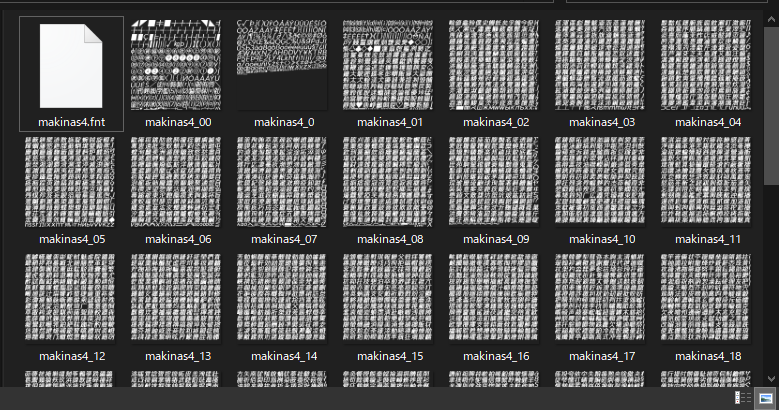
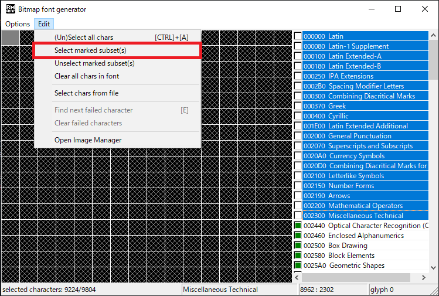

# Fnt2Bin

This is the tool to converting `.fnt` file to `.bin` file.
Using for creating customize file for `osu-framework`.

## How to create customize font

1. First, follow [this articla](https://github.com/ppy/osu-framework/wiki/Setting-Up-Fonts#converting-to-binary-font-and-texture-files) to convert font file(`.otf`) into `.fnt` and lots of `png` file.
    
    If everything goes well, should see this in your export folder.

    
    Also notice that can shift-and select right side, then press `Select marked subset` to select those subset(character set) wants to export, recommand to select all for preventing some character is missing.
    
    And should follow the naming at this time: 
    | FontUsage.Family | FontUsage.Weight | FontUsage.Italics | Font file name           |
    |:----------------:|------------------|-------------------|--------------------------|
    | MyAwesomeFont    | "Light"          | false             | MyAwesomeFont-Light      |
    | MyAwesomeFont    | "Bold"           | true              | MyAwesomeFont-BoldItalic |
    | MyAwesomeFont    | null             | false             | MyAwesomeFont            |
    | MyAwesomeFont    | null             | true              | MyAwesomeFont-Italic     |
    
2. Use `this program` to convert `.fnt` into `.bin` file by drag to `.fnt` file into program.
3. Then continue reading [this articla](https://github.com/ppy/osu-framework/wiki/Setting-Up-Fonts#adding-the-custom-font-to-the-font-store) or [this article](https://github.com/ppy/osu-templates/issues/26#issuecomment-604788278) to import this file to your awsome project.
4. If everything works well, should be able to see new font on your game / ruleset.

